# CONNECT 4

_CONNECT 4_ is a website hosting a game called [Connect Four](https://en.wikipedia.org/wiki/Connect_Four)*. The site will be targeted towards people who want to play a quick and fun game regardless of their age. The site can be used for adults to have a short getaway and for children to learn the rules. The main goal of this project is to implement my JavaScript knowledge in a real-world context.

*Connect Four is a classic two-player strategy game, in which players take turns dropping their coloured discs into a 6-row by 7-column grid to connect 4 of their discs in a line either horizontally, vertically or diagonally.


### View the live project [here](https://sejungkwak.github.io/connect-4/)

<br>

# Table of Contents

[User Experience (UX)](#user-experience-ux)
  - [User Stories](#user-stories)
  - [Design](#design)
  - [Wireframes / Mockups](#wireframes--mockups)
  - [Flowchart](#flowchart)

[Features](#features)
  - [Implemented Features](#implemented-features)
  - [Features Left to Implement](#features-left-to-implement)

[Technologies Used](#technologies-used)
  - [Languages](#languages)
  - [Library](#library)
  - [Programs](#programs)

[Testing](#testing)
  - [Testing User Stories](#testing-user-stories-from-user-experience-ux-section)
  - [Code Validation](#code-validation)
  - [Functionality Testing](#functionality-testing)
  - [Performance Testing](#performance-testing)
  - [Bugs](#bugs)

[Deployment](#deployment)
  - [Github Pages](#github-pages)
  - [Making a Local Clone](#making-a-local-clone)
  - [Forking this Repository](#forking-this-repository)

[Credits](#credits)
  - [Code](#code)
  - [Content](#content)

<br>

# User Experience (UX)

## User Stories

- As a First Time Visitor,
  - I want to know how to play the game so that I can enjoy it fully.
  - I want to know clearly when it is my turn so that I don't delay the game.
  - I want to see the game board screen again when the game is over so that I can figure out why I've won or lost.

<br>

- As a Returning Visitor,
  - I want to be able to play the game on my phone so that I can play it during a break at work.
  - I want to play the game with my kids so that we can have fun together.
  - I want to play the game against the computer so that I can play practice games.

<br>

- As a Frequent User,
  - I want to be able to check my rank so that I can see how good I am.
  - I want to be able to contact the developer so that I can suggest my ideas.
  - I want to play the game against other players online so that I can experience different play styles.

<br>

## Design

- Colour Scheme

  The best-known version of the physical game set that has been produced by [Hasbro](https://shop.hasbro.com/en-us/product/connect-4-game:80FB5BCA-5056-9047-F5F4-5EB5DF88DAF4) uses 3 colours: blue for the grid, yellow and red for discs. I have followed this colour convention with my own interpretation using [Canva](https://www.canva.com/) > Create a design > Logo > Styles and the colour picker.

  

- Typography

  - Headings: [Fredoka One](https://fonts.google.com/specimen/Fredoka+One) is used with Cursive as the fallback font in case the font isn't being imported into the site correctly. I have chosen Fredoka One for its big, bold and rounded shape which gives a soft feeling and adds a little fun to headings.

  - Paragraph: [Poppins](https://fonts.google.com/specimen/Poppins) is used with Sans Serif as the fallback font. I have chosen Poppins for readability and its sharp corners as opposed to Fredoka One.

- Logo

  The logo has the website name _CONNECT 4_ with the number 4 in a yellow font on a red background circle which are the main colours of the game.

  

- Favicon

  The favicon has the number 4 in a yellow font on a red background circle in the same style as the logo.

  

<br>

## Wireframes / Mockups

- _CONNECT 4_ is designed with the following goals in mind:
	- A user can navigate to other pages while playing a game, and resume the game without having to restart.
	- A user can start a game with as few clicks as possible.
- To achieve these goals:
	- It is written in a single HTML file.
  - Each section is shown one at a time. This provides the user with the experience of separate pages for each section while ensuring the browser does not need to reload the page.
	- The __New game__ page is on the landing screen.
- I created wireframes and mockups for mobile and desktop.
- [View Wireframes and Mockups](documentation/DESIGN.md)

<br>

## Flowchart

I created a flowchart to visualise the process before writing JavaScript code.

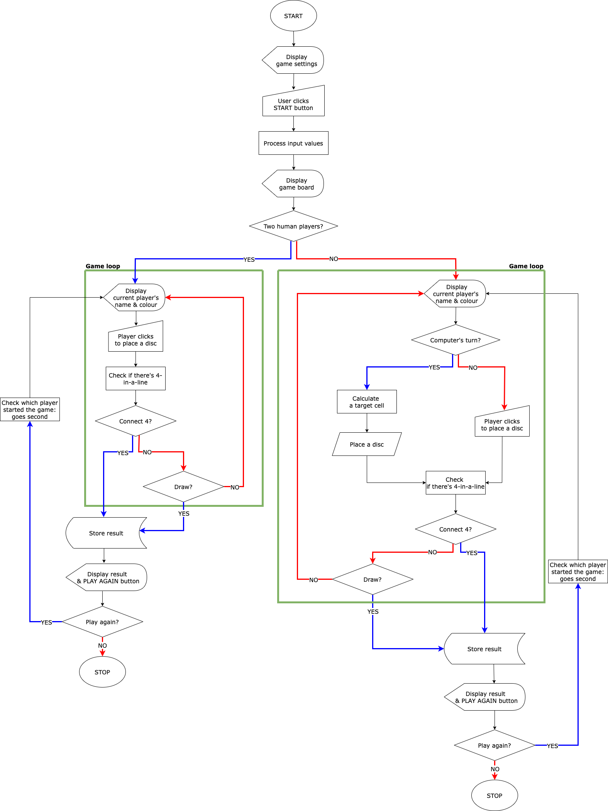

[Back To **Table of Contents**](#table-of-contents)

<br>

# Features

## Implemented Features
The site features a fully responsive design and contains 4 game-related pages(__New game__, __Play__, __Help__, __Leaderboard__), 3 supporting pages(__Contact__, __Success__, __Fail__) and a 404 page. The header and footer are identical for all pages except the 404 page.

- Header

  

  - The header is fixed to the top of the screen even when the user is scrolling down the page to allow easier navigation.
  - The logo is linked to the __New Game__ page and each menu item(New game, Play, Help, Leaderboard) is linked to each page respectively to allow easier navigation.
  - The navigation menu item for the current page is highlighted and underlined as the user browses the site for ease of use.
  - The navigation menu collapses on small devices less than 600px width to optimise the menu for smaller screen sizes.

    

- Footer

  

  - The footer includes the two following links

    - A link to the project's [_GitHub_ repository](https://github.com/sejungkwak/connect-4) to allow the users to learn more about this project.
    - A link to the __Contact__ page to allow the users to send a message to me directly from the site.
  
  - The external link opens in a new tab to allow the user to return to _Connect 4_ more easily.

- __New Game__ page

  

  - Upon landing _Connect 4_, the __New Game__ page is displayed for quick access to the game.
  - The form allows users to change the game settings.
  - The computer/human and colour options are switched when the user changes to an invalid option.
    - Both players must have a unique colour.
    - At least one human player is required.

    

  - Feedback is provided when the user tries to start a game with the same name for both players.

    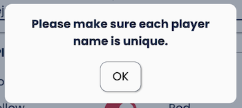

  - This page provides two buttons that open the __Play__ page.

    - __START__: The user can start a new game.
    - __CLOSE__: The user can resume the game they are playing.

- __Play__ page

  

  - This page displays the current player in the heading, allowing the user to make a move promptly.
  - There are sound effects when a disc is being placed and a game ends for a more enjoyable experience.
  - The user can turn on and off the sound as they prefer.
  - The first character of the disc colour is inside all placed discs for the colour blind users.
  - The game board is being adjusted to the screen size.
  - The user can play the game with arrow keys to allow the user to control depending on their preference.
  - If the user hasn't started a game and opens this page, the message displays instead of the game board to let the user know how to start a game. The user can easily navigate to the __New Game__ page by clicking the button.

    

  - The display mode alert is displayed when the whole game board is not shown on the screen. However, if the player still wants to play in landscape mode, they can press the __OK__ button and continue to play.

    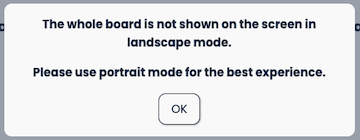

- __Help__ page

  

  - This page contains 5 articles about the game objective, how to play, keyboard controls, points system and leaderboard to help users understand the game and the site-specific rules.
  - Less than 1024px width devices show each article in a single column to optimise the layout.

- __Leaderboard__ page

  

  - This page displays the top 5 players who gained the highest points with the number of games they won and the win rate to allow them to see their performance.
  - The user can delete data from local storage with the __Delete data__ button. Upon clicking the button, the alert box is displayed to prevent the user from deleting it accidentally.

    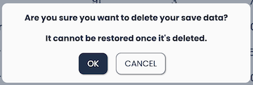

  - The message is shown when there is no data to display or it is unable to get the data from local storage.

    

- __Contact__ page

  

  - This page contains brief information about me and the contact form.

    - Information about me

      - This part lets the users know about me to make them more comfortable and more likely to provide their feedback.

    - Contact form

      - This form allows the user to send their message without having to open their email client.
      - All the fields are required and give feedback if empty(including whitespace) or invalid.
      - Upon clicking the __Send__ button, feedback is provided by redirecting the user to either the __Success__ or __Fail__ page depending on the status.
      - Less than 1024px width devices show each article in a single column to optimise the layout.

- __Success__ page

  

  - This page gives feedback to the user when their message has been sent successfully.
  - It includes a button to the Home page for quick access.

- __Fail__ page

  

  - This page gives feedback to the user when there was a problem delivering their message.
  - It includes a button to go back to the __Contact__ page.

- 404 page

  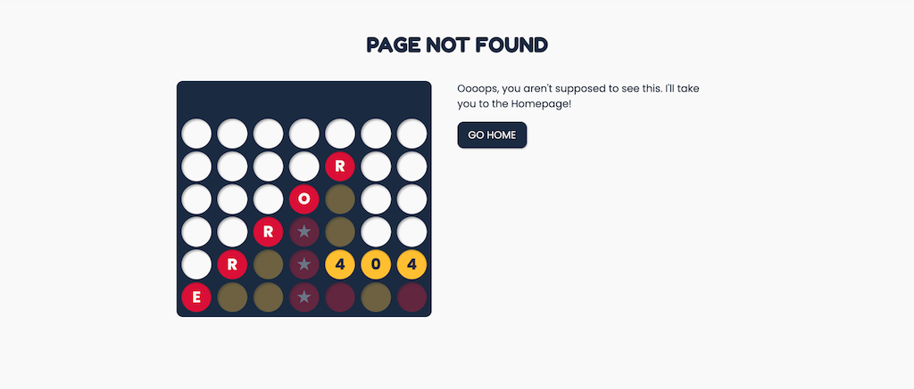

  - This page gives feedback to the user when they try to access nonexistent pages on the site.
  - The blinking animation is disabled for any user with reduced motion enabled in their preferences on their device.
  - It includes a button to the Home page for quick access.
  - [View 404 page](https://sejungkwak.github.io/connect-4/404.html)

<br>

## Features Left to Implement

- Smarter AI Player

  The computer player picks a cell to place a disc randomly, so a game against the computer is too easy. I would like to build a smarter AI that prevents the player from winning so easily for a more enjoyable game.
  There is Pascal Pons's [tutorial blog](http://blog.gamesolver.org/) about the connect 4 solver using the alpha-beta pruning algorithm. Unfortunately, I was not able to fully understand the algorithm in depth to implement it into this project.

- Online live game platform

  Users can currently play on one device and cannot play against another player remotely. I would like to implement an online live game platform when I am confident in building a back-end.

- Database

  When an online live game platform is available, it is more appropriate to use an online database to show all the players from the site on a single leaderboard.

[Back To **Table of Contents**](#table-of-contents)

<br>

# Technologies Used

## Languages

- [HTML5](https://en.wikipedia.org/wiki/HTML5) was used to present and structure content.
- [CSS3](https://en.wikipedia.org/wiki/CSS) was used to style content.
- [JavaScript](https://en.wikipedia.org/wiki/JavaScript) was used to create dynamic and interactive content.

<br>

## Library

- [EmailJS](https://www.emailjs.com/) was used to receive the customised contact form directly from users.

<br>

## Programs

- [Am I Responsive](http://ami.responsivedesign.is/) was used to create the image showing a responsive design for the README.
- [Awesome Screenshot and Screen Recorder](https://chrome.google.com/webstore/detail/awesome-screenshot-and-sc/nlipoenfbbikpbjkfpfillcgkoblgpmj) was used to take the screenshots of the entire page for the README.
- [Balsamiq](https://balsamiq.com/) was used to create the wireframes.
- [BrowserStack](https://live.browserstack.com/dashboard#os=iOS&os_version=12.0&device_browser=safari&zoom_to_fit=true&full_screen=true&url=https%3A%2F%2Fsejungkwak.github.io%2Fconnect-4%2F&speed=1) was used to test the site on different devices/browsers.
- [Can I use](https://caniuse.com/) was used to check browser compatibility.
- [Canva](https://www.canva.com/en_gb/) was used to create the logo and favicon.
- [Chrome DevTools](https://developer.chrome.com/docs/devtools/) was used to view the site's styling, to debug during development and to check runtime performance.
- [Diagrams.net](https://app.diagrams.net/) was used to create the flowchart.
- [Eightshapes](https://contrast-grid.eightshapes.com/?version=1.1.0&background-colors=&foreground-colors=%231C304A%0D%0A%23DE0F3F%0D%0A%23FFC736%0D%0A%23FAFAFA&es-color-form__tile-size=regular&es-color-form__show-contrast=aaa&es-color-form__show-contrast=aa&es-color-form__show-contrast=aa18) was used to check the colour combination for accessibility purposes.
- [Ezgif](https://ezgif.com/) was used to convert PNG format images to WebP for the favicon.
- [Favicon.io](https://favicon.io/) was used to create the favicon.
- [Figma](https://www.figma.com/) was used to create the mockups.
- [Font Awesome](https://fontawesome.com/) was used for the responsive hamburger menu icons as well as the _GitHub_ and envelope icon in the footer. Each icon file was downloaded and converted to the SVG path using VS Code.
- [GIPHY](https://giphy.com/) was used to convert video files to GIFs for the README.
- [Git](https://git-scm.com/) was used for version control.
- [GitHub](https://github.com/) was used to store and deploy the project's code.
- [Gitpod](https://www.gitpod.io/) was used to develop and test my code.
- [Google Fonts](https://fonts.google.com/) was used to import Fredoka One and Poppins into the style.css file.
- [JSHint](https://jshint.com/) was used to check the JavaScript validity.
- [Regex101](https://regex101.com/) was used to create a regular expression to remove whitespace inside a string for the contact form.
- [Visual Studio Code](https://code.visualstudio.com/) was used to edit my code and create SVG paths from SVG image files.
- [W3C CSS Validation Service](https://jigsaw.w3.org/css-validator/) was used to check the CSS validity.
- [W3C Markup Validation Service](https://validator.w3.org/) was used to check the HTML markup validity.
- [WAVE](https://wave.webaim.org/) was used to evaluate the accessibility.

[Back To **Table of Contents**](#table-of-contents)

<br>

# Testing

## Testing User Stories from User Experience (UX) Section

- As a First Time Visitor,

  - [x] I want to know how to play the game so that I can enjoy it fully.

    : The user can find the rules on the __Help__ page as well as other information to enhance their play experience.

  - [x] I want to know clearly when it is my turn so that I don't delay the game.

    : The name on the turn indicator has a bigger font size and is hard to overlook.

      

  - [x] I want to see the game board screen again when the game is over so that I can figure out why I've won or lost.

    : The whole game board is still visible even when the game is over.

      

<br>

- As a Returning Visitor,

  - [x] I want to be able to play the game on my phone so that I can play it during a break at work.

    : The site is fully responsive. The user can play on any device size.

      

  - [x] I want to play the game with my kids so that we can have fun together.

    : The game can be played with two human players by setting both human/computer sliders to human on the __New Game__ page.

  - [x] I want to play the game against the computer so that I can play practice games.

    : The game can be played against the computer by setting one of human/computer sliders to computer on the __New Game__ page.

<br>

- As a Frequent User,

  - [x] I want to be able to check my rank so that I can see how good I am.

    : The user can check their points, the number of games they won and the win rate on the __Leaderboard__ page.

  - [x] I want to be able to contact the developer so that I can suggest my ideas.

    : The user can send a message via the contact form without having to open their email client.

      | Contact form | Received email |
      | :----------: | :------------: |
      | 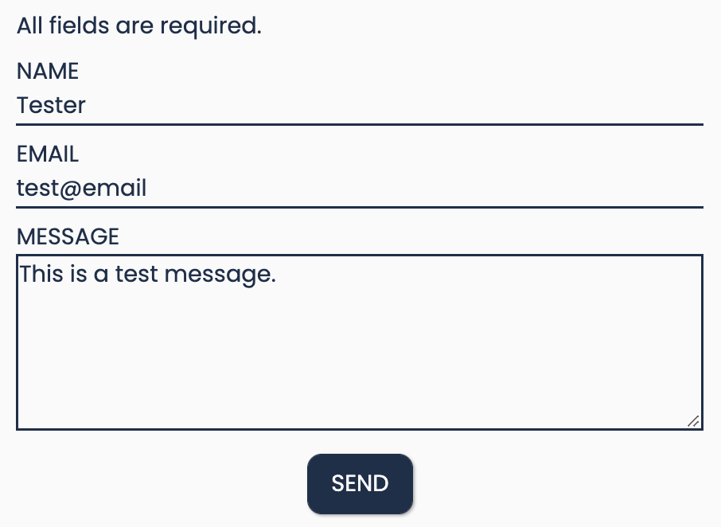 | 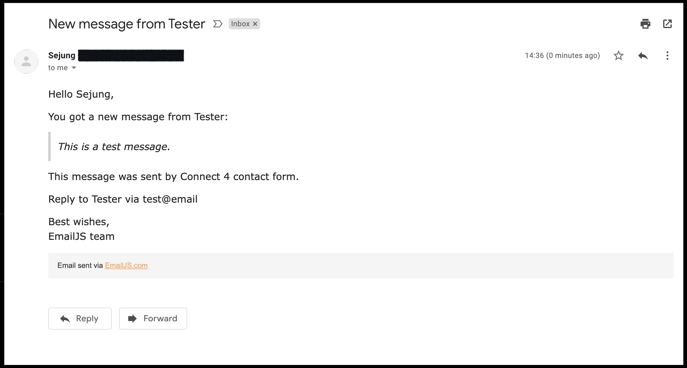 |

  - [ ] I want to play the game against other players online so that I can experience different play styles.

    : This feature has not been implemented as my back-end knowledge is not yet strong enough to build an online game platform.

<br>

## Code Validation

- HTML Validation
  - No errors or warnings were found when passing through the [W3C Markup Validator](https://validator.w3.org/).

- CSS Validation
  - No errors or warnings were found when passing through the [W3C CSS Validator](https://jigsaw.w3.org/css-validator/).
  - There were warnings when I first ran through the validator and I resolved them. Please refer to the link below for more details.

- JS Validation
  - 1 warning was found when passing through [JSHint](https://jshint.com/).
    - The remaining warning of `one undefined variable` is because I used a library called _EmailJS_.
  - There were more warnings when I first ran through the validator. I resolved the majority of them, but one remains. Please refer to the link below for more details.

- [View details](documentation/VALIDATION.md)

<br>

## Functionality Testing

- I have tested the site's functionality manually in Safari and Chrome on different device types.
  - Mobile
    - Safari version 15 on iOS 15.4.1
    - Chrome version 100.0 on Android 9
  - Tablet
    - Chrome version 78.0 on Android 8.1.0
  - Desktop
    - Safari version 15.4 on macOS Monterey version 12.3.1
    - Chrome version 100.0 Windows 10
- During the tests, I found bugs below.
  - The __OK__ button on the display mode alert was not accessible when the game result box was on the screen.
  - Custom validation messages for the contact form kept showing even when the input value was valid.
  - A column indicator disc disappeared even when pressing the down arrow key on the full column.
- I have fixed the issues and documented them in the [fixed bugs](#fixed-bugs) section. Please refer to the last three items in the section for more details.
  - Inaccessible display mode alert button
  - Contact form custom validation error
  - Column indicator disc disappearing

- All the tests passed after an aditional test: [View details](documentation/FUNCTIONALITY.md)

<br>

## Performance Testing

- I have measured the performance, accessibility, best practices and SEO using [Lighthouse](https://developers.google.com/web/tools/lighthouse) in Chrome DevTools in incognito mode.
- The pages(__New game__, __Play__, __Help__, __Leaderboard__) in the navigation bar are all written in the index.html file. Lighthouse generates a report per URL.

  - Mobile

    | Page\Category | Performance | Accessibility | Best practices | SEO |
    | :-----------: | :---------: | :-----------: | :------------: | :-: |
    |   New game / Play / Help / Leaderboard | 99 | 100 | 100 | 100 |
    |   404 | 99 | 100 | 100 | 100 |
  
  - Desktop

    | Page\Category | Performance | Accessibility | Best practices | SEO |
    | :-----------: | :---------: | :-----------: | :------------: | :-: |
    |   New game / Play / Help / Leaderboard | 100 | 100 | 100 | 100 |
    |   404 | 100 | 100 | 100 | 100 |

  - [View screenshots](documentation/PERFORMANCE.md)

## Bugs

### Fixed Bugs

- Second game board

  - Error: A second board was created when clicking the __START__ button on the __New game__ page after playing a game.
  - Reason: I did not add code that removes an existing board when creating a new one.
  - Fix: I added the code to clear the content inside the board's parent element before creating a new board.
  - [View commit details](https://github.com/sejungkwak/connect-4/commit/5b12d55a5740555e9ab762079e0e01057cebb5b0)

- Alert overlay staying on the screen even on an unrelated page

  - Error: Overlays created on the __New game__ page remain visible when opening a different page.
  - Reason: The overlay was added to the `main` element, not the __New game__ page(`section`).
  - Fix: I changed the code to add the overlay inside the __New game__ page instead of the `main` element.
  - [View commit details](https://github.com/sejungkwak/connect-4/commit/73f03cc6f8c56746e15062147864f5b78e63ba20)

- Consecutive mouse clicks disrupting the turn order

  - Error: The disc was not placed with the right colour when the mouse was clicked twice before the computer placed a disc.
  - Reason: The computer places a disc a second after a human player makes a move. When the mouse was clicked faster than the computer's move, the `mouseclick` event listener was called twice.
  - Fix: I initialised a global variable called 'computerTurn' and added/changed the boolean value at the beginning of a game, and the beginning and end of the computer's turn.
  - [View commit details](https://github.com/sejungkwak/connect-4/commit/5ae90aabc321edcfe04be774ba933cfc212a3f57)

- Unexpected trailing zeros in the win rate

  - Error: Insignificant trailing zeros were displayed in the win rate(the number of wins / total number of played games * 100) on the __Leaderboard__ page. The example in the below image is the result of 1/7 * 100.

    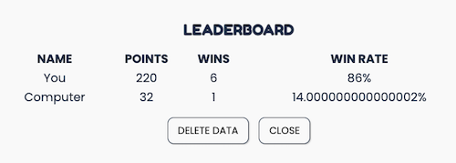

  - Reason: This is a well-known issue related to [floating-point arithmetic](https://floating-point-gui.de/). I used the `toFixed()` method to avoid it. However, I added another arithmetic operator of `* 100` after `toFixed()`.
  - Fix: I moved the `toFixed()` method to the end of the operators after all the calculations are done.
  - [View commit details](https://github.com/sejungkwak/connect-4/commit/c3baa2b66fee59460e8a7f4bf4279773f9ff9300)

- `keydown` event triggered twice

  - Error: Pressing the left or right arrow key made a column indicator disc move twice after the second game.

    

  - Reason: I could not figure out the exact reason for this bug, but I saw the `keydown` event listener executed twice while debugging the issue.
  - Fix: I changed the arrow keys' `keydown` event listener to a global function.
  - [View commit details](https://github.com/sejungkwak/connect-4/commit/b2677bae7450e36b54f738e7ecc57aaff3f35e7a)

- Displaying 2 column indicator discs at the same time

  - Error: A previous column indicator disc stayed visible when switching the keyboard control to the mouse.

    

  - Reason: The `mouseout` event handler was not called when switching the keyboard control to the mouse.
  - Fix: I added code that makes the column indicator discs invisible in the `mouseover` event handler.
  - [View commit details](https://github.com/sejungkwak/connect-4/commit/e108aaeef3595c3de1ec5238cd304e90e547d95a)

- Multiple alert overlay

  - Error: An alert overlay on the __New game__ page kept being created when pressing the space bar multiple times on the same checkbox.
  - Reason: I did not consider keyboard controls, and there was no code to prevent the overlay from being created.
  - Fix: I added a condition to check if there is already an overlay on the __New Game__ page. If there is, delete it before creating another one.
  - [View commit details](https://github.com/sejungkwak/connect-4/commit/2b42419d3613ae65bc59db6f0ccb8056ff0b4477)

- Browser support for `aspect-ratio`

  - Error: Daniel Callaghan at Code Institute spotted a bug which prevented him from placing a disc if the computer didn't place a disc in the target column first and the board was squashed.

    

    (The image was provided by Daniel Callaghan through the [_Slack_](https://slack.com/intl/en-ie/) __peer-code-review__ channel)
  
  - Reason: According to [_Can I use_](https://caniuse.com/), the `aspect-ratio` property is only supported by newer browser versions that were released after 2021.
  - Fix: I removed the `aspect-ratio` property in CSS and added code to set the height of each cell in JS.
  - [View commit details](https://github.com/sejungkwak/connect-4/commit/fed5b161ad1f43bbafc72601db26331cb7735b39)

- Screen resizing
  
  - Error: Other bugs were detected from the above change.
    
    - The height of cells was not dynamically adjusted to the screen resizing.
    - The layout of other pages was not changed by screen resizing if a game hadn't been started.

  - Reason: `Uncaught TypeError: Cannot read properties of null (reading 'clientWidth')`. The property I was referring to is a cell(`div`) in the game board, and there is no cell if the user hasn't pressed the __START__ button on the __New Game__ page.
  - Fix: I added the code that sets the cell's height when the __Play__ page opens. I also added a condition inside the `resize` event listener to check if a game has started. If so, it calls the function that sets the cell's height.
  - [View commit details](https://github.com/sejungkwak/connect-4/commit/32edb5295e56a90bdf7a94f0afbf6f50cfacfd08)
  - However, I removed the code in JS at the end since I needed to add extra code for the 404 page which is not linked to the JS file. I added `calc(board width - rows' block margin)` to the board container's height instead.
  - [View commit details](https://github.com/sejungkwak/connect-4/commit/935b172029f2b459480588464926b4f33f9dc381)

- Browser support for `min()` and `gap` for `flex`

  - Error: The layout was not what I designed when viewing in an older browser.

    

  - Reason: According to [_Can I use_](https://caniuse.com/), `min()` and `gap` for the flexbox are supported by newer browser versions that were released after 2019 and 2020 respectively.
  - Fix: I replaced the `min()` property with `width` and `max-width` where possible or added a media query where impossible. For the `gap` property, I removed it and added a margin to the child element.
  - [View commit details](https://github.com/sejungkwak/connect-4/commit/935b172029f2b459480588464926b4f33f9dc381)

- Sound delay in Safari

  - Error: The disc drop sound was delayed or wasn't played in Safari when multiple discs were placed in a short time.
  - Reason: I was not able to spot the exact reason for the issue, but this seems something to do with _Apple_ disabling automatic sound playing.
  - Fix: I moved the code that calls the `Audio()` constructor inside the function that plays the sound. However, this change caused a freeze issue on iOS. Please refer to the next bug fix for more details.
  - [View commit details](https://github.com/sejungkwak/connect-4/commit/82caddcc05e56dec61f56d117416b68d31877b19)

- Freeze issue when the sound is on in Safari and Chrome on iOS

  - Error: The __Play__ page froze occasionally when the sound was on in Safari and Chrome on iOS.
  - Reason: The audio delay on iOS seems to be a known issue as _Apple_ have disabled automatic sound playing by default.
  - Fix: I created a global variable that stores the `Audio()` constructor. I set `autoplay = true` to it and added a silent MP3 file. I then changed the `src` property in the function that plays the sound.
  - [View commit details](https://github.com/sejungkwak/connect-4/commit/7c255968d9901c4dd6fafe4b2fbb5d10149edc7d)

- End game sound bug in Safari on iOS

  - Error: The end game sound was not playing when the computer wins in Safari on iOS.
  - Reason: I was not able to figure out the reason for the bug. However, I reckon it is related to _Apple_ disabling automatic sound playing.
  - Fix: I used a single global variable that stores the `Audio()` constructor for all sound effects.
  - [View commit details](https://github.com/sejungkwak/connect-4/commit/2b9b6476a0d024555f5adc93c45eabac2257ebd2)

- Inaccessible display mode alert button

  - Error: The display mode alert was displayed in the layer below the game result popup. When both were visible, the alert's __OK__ button was not accessible.

    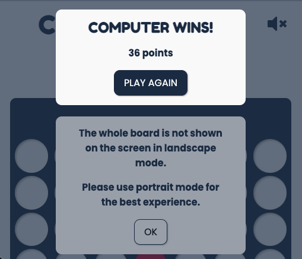

  - Reason: The display mode alert is drawn before the game result popup in the DOM.
  - Fix: I increased the `z-index` value for the display mode alert to ensure the alert's __OK__ button is always accessible.
  - [View commit details](https://github.com/sejungkwak/connect-4/commit/ceefa4fb4e915d9ce71f26b6463ee30457f9f887)

- Contact form custom validation error

  - Error: The custom validation message kept showing even when the input value was valid if the name or message field was previously invalid.

    

  - Reason: I used the `setCustomValidity()` method to give feedback if the message is less than 10 characters excluding whitespace. This function needs to be reset after firing which I did not consider.
  - Fix: I added a change event listener to the `input`(name) and `textarea`(message) elements and added `setCustomValidity('')` inside the code block.
  - [View commit details](https://github.com/sejungkwak/connect-4/commit/b62ec62958d74c971d97e7654fa26a9b4fea0d53)

- Column indicator disc disappearing

  - Error: Attempting to drop a disc with the down arrow key made the column indicator disc vanish even though the column was full and it was not a valid target.
  - Reason: The code to make the column indicator disc invisible to simulate movement was always running when pressing the arrow keys.
  - Fix: I changed the code to make the column indicator disc remain visible when pressing the down arrow key in a column that is already full.
  - [View commit details](https://github.com/sejungkwak/connect-4/commit/c90f4779675562ad1df9f0566c9b60b9028b611e)

### Known Bugs

- Federated Learning of Cohorts (FLoC)

  - There is an error message: `Error with Permissions-Policy header: Unrecognized feature: 'interest-cohort'.` in the console in Chrome and Opera. This appears because _GitHub Pages_ has disabled Federated Learning of Cohorts(FLoC) which is an API for gathering users' data.

    

  - I have found more information about FLoC in the following documents:
    - WICG's [FLoC repository](https://github.com/WICG/floc)
    - [Federated Learning of Cohorts (FLoC)](https://docs.gitlab.com/ee/user/admin_area/settings/floc.html) on [GitLab Docs](https://docs.gitlab.com/)
    - [GitHub Pages: Permissions-Policy: interest-cohort=() Header added to all pages sites](https://github.blog/changelog/2021-04-27-github-pages-permissions-policy-interest-cohort-header-added-to-all-pages-sites/) on [GitHub Changelog](https://github.blog/changelog/)
  - According to _GitHub Pages_, FLoC has been disabled to avoid users being tracked and categorised. As the Chrome DevTools Lighthouse does not report any negative performance issues, I have decided not to pursue any further.

- User-Agent reduction

  - There is an issue: `Audit usage of navigator.userAgent, navigator.appVersion, and navigator.platform "emailjs"` in the console in Chrome and Opera. This appears because _Google_ has planned to reduce User-Agent for improving user privacy and this part `t.exports=n("navigator","userAgent")||""}` in [EmailJS code](https://cdn.jsdelivr.net/npm/@emailjs/browser@3/dist/email.min.js) seems to be causing the issue.

    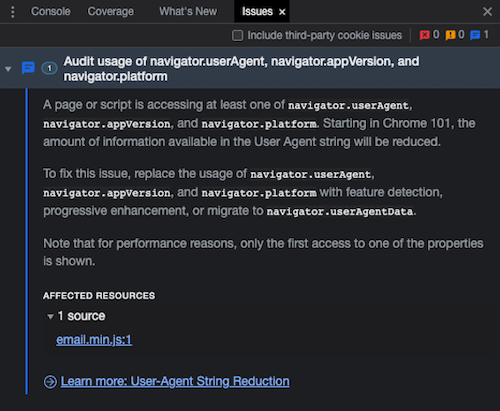

  - I have found more information about _Google_'s User-Agent reduction plan in the article [User-Agent reduction
](https://developer.chrome.com/docs/privacy-sandbox/user-agent/#:~:text=%23%20What%20is%20User%2DAgent%20reduction,a%20reduced%20User%2DAgent%20header.) on [Chrome Developers](https://developer.chrome.com/)

  - The User-Agent deprecation does not prevent me from using _EmailJS_ and I was not able to find a better alternative to it, so I have decided to ignore this issue for now.

[Back To **Table of Contents**](#table-of-contents)

<br>

# Deployment

## GitHub Pages

The site was deployed to _GitHub Pages_ using the following steps:

  1. Navigate to [my GitHub Repository](https://github.com/sejungkwak/connect-4).
  2. Click the __Settings__ button on the menu.
  3. Select __Pages__ from the left side vertical menu.
  4. Under __Source__, click the dropdown called __None__ and select __main__.

  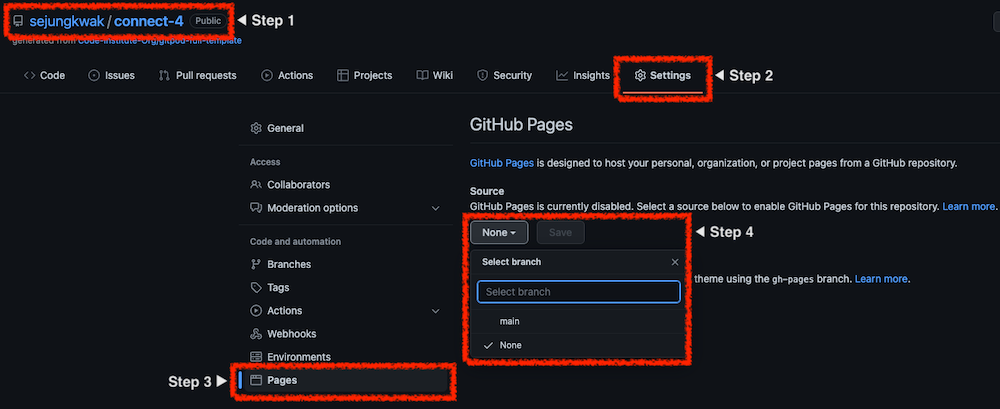

  5. Click the __Save__ button.

  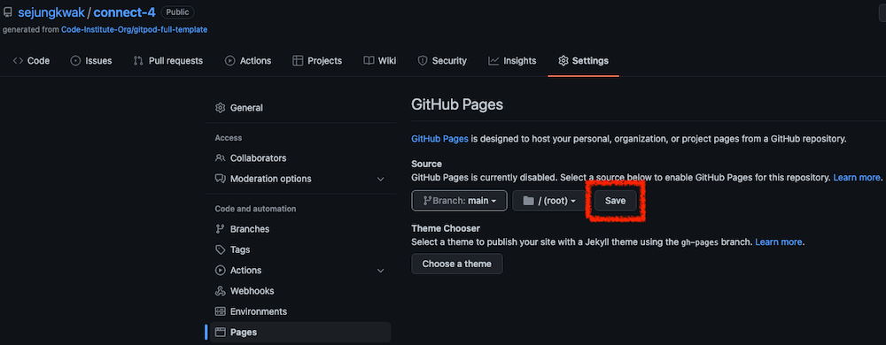

  6. The page is automatically refreshed with a bar which shows the status and live link.

  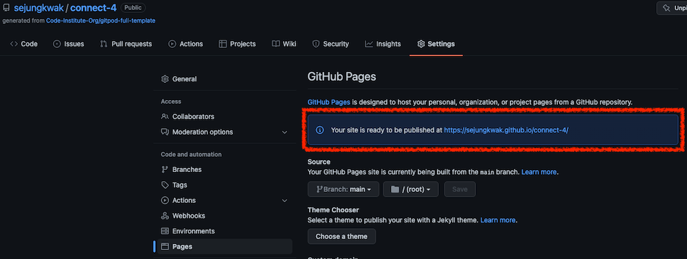

  7. Refresh the page. The bar turns green to indicate the successful deployment.

  

The live link can be found here - https://sejungkwak.github.io/connect-4/

<br>

## Making a Local Clone
These steps demonstrate how I cloned my repository to create a local copy on my computer to run the code locally.

  1. Navigate to [my GitHub Repository](https://github.com/sejungkwak/connect-4).
  2. Click the __Code__ button above the list of files.

  

  3. Select __HTTPS__ under __Clone__. I have chosen this option as it is simpler than SSH.
  4. Click the copy icon on the right side of the URL.

  

  5. Open the Terminal.
  6. Change the current working directory to the location where I want the cloned directory.
  7. Type `git clone ` and then paste the URL I copied in step 4.
  
  ```
  $ git clone https://github.com/sejungkwak/connect-4.git
  ```

  

  8. Press enter. Messages are displayed in the Terminal to indicate the local clone has been successfully created.

  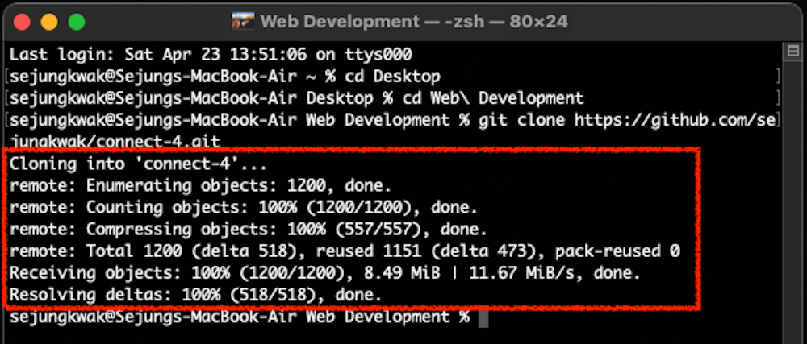

<br>

## Forking this Repository
These steps demonstrate how to make a copy of this repository on your _GitHub_ account to make changes without affecting this repository or to deploy the site yourself.

  1. Log in to your _GitHub_ account.
  2. Navigate to [this Connect 4 repository](https://github.com/sejungkwak/connect-4).
  3. Click the __fork__ button* on the top right side of the repository.

  *The button in the image is disabled since the repository belongs to me. It should be active if you logged on your account.

  

  3. You should now have a copy of the original repository in your _GitHub_ account.
  4. You can make a local clone from the copied repository on your computer using the steps demonstrated in [Making a Local Clone](#making-a-local-clone) and/or deploy to _GitHub Pages_ using the steps demonstrated in [GitHub Pages](#github-pages).

[Back To **Table of Contents**](#table-of-contents)

<br>

# Credits

## Code

- I referenced the [MDN Web Docs](https://developer.mozilla.org/en-US/), [W3schools](https://www.w3schools.com/) and [Stack Overflow](https://stackoverflow.com/) for JavaScript concepts.

- Checking for a win
  - Source: Tom Campbell's YouTube video [Coding Connect 4 with JavaScript](https://www.youtube.com/watch?v=kA9OOeUXXSU)
    - Using the difference of the cells' indices: On a 6-row by 7-column grid where the top leftmost position is 0 and the top rightmost position is 6, the 2 consecutive cells in a horizontal line have 1 index difference, in a vertical line have 7, in a main diagonal line(\\) have 8 and in an off-diagonal line(/) have 6.
  - I adapted his algorithm to check for a win, but I created my own approach by retrieving the cell's owner in the `div`(cell)'s `class` attribute.

- Merging multiple objects into one
  - Source: CRice's answer on [Stack Overflow](https://stackoverflow.com/questions/49020000/reduce-multiple-objects-into-one-adding-values-together)
    - Checking if there are more than 2 objects in an array that have the same value and merging those objects using the `reduce()` and `find()` methods.
  - I used this method to merge objects from local storage data to display on the __Leaderboard__ page.

- Sorting data by the value inside objects
  - Source: [MDN Web Docs](https://developer.mozilla.org/en-US/docs/Web/JavaScript/Reference/Global_Objects/Array/sort)
    - Comparing the values of objects using the subtraction operator to sort the objects.
  - I used this method to sort the data by player's points to display on the __Leaderboard__ page.

- Jump to the top of the page
  - Source: Ganesh Ghalame's answer on [Stack Overflow](https://stackoverflow.com/questions/1144805/scroll-to-the-top-of-the-page-using-javascript)
    - Using the `scrollTo({ top: 0, behavior: 'smooth' })` method to jump to the top of the page smoothly.
  - I found that using this technique, I could display a new page much more conveniently on a mobile device, by opening it at the very beginning.

- Detect touchscreen device
  - Source: KaMeHb's answer on [Stack Overflow](https://stackoverflow.com/questions/56324813/how-to-detect-touch-device-in-2019)
    - The `matchMedia()` method and media feature with the `matches` property to detect touchscreen devices.
  - I used this method to detect touchscreen devices and not add the `mouseover` event listener to the cell.

- iPhone audio autoplay
  - Source: user2415116 and AndrewL's answer on [Stack Overflow](https://stackoverflow.com/questions/31776548/why-cant-javascript-play-audio-files-on-iphone-safari)
    - Storing the `Audio()` constructor in a variable, setting `autoplay = true` to it, adding a silent MP3 file and changing `src` afterwards enables it to play the sound once the user turns on the sound with an iPhone.
  - I used this method to fix bugs that were causing sound-related issues on iOS.

- Helper functions
  - Source: Web Dev Simplified's [Stop Wasting Your Time - Use These 16 JS Utility Functions Instead](https://www.youtube.com/watch?v=EoUIS2PxKCs&t=202s)
    - Storing a repeated method in a function to reduce typing.
  - I used this method to store `document.getElementById()` and `document.querySelectorAll()` which is then stored in an array using the spread operator.

## Content

- Sounds

  - I have downloaded 2 sounds from [Zapsplat](https://www.zapsplat.com/) and used them for the game sound effects.
    - Disc dropping: [Bright ping or pluck, notification tone, generic use. Version 1](https://www.zapsplat.com/music/bright-ping-or-pluck-notification-tone-generic-use-version-1/)
    - Game over: [Alert, prompt, win, positive tone 005](https://www.zapsplat.com/music/alert-prompt-win-positive-tone-005/)

- Rules

  - I have found the information about the game rules on [Gamesver](https://www.gamesver.com/the-rules-of-connect-4-according-to-m-bradley-hasbro/) and [F.G. Bradley's](https://www.fgbradleys.com/rules/Connect%20Four.pdf) and used them for reference when creating the __Help__ page.

- Flowchart

  - I have found Ahmad M. Sarhan, Adnan Shaout and Michele Shock's study paper [Real-Time Connect 4 Game Using Artificial Intelligence](https://thescipub.com/pdf/jcssp.2009.283.289.pdf). The study itself did not influence this project because it was implementing AI using the influence mapping algorithm in C++. However, the flowcharts in the paper helped me create my own flowchart.

[Back To **Table of Contents**](#table-of-contents)

<br>